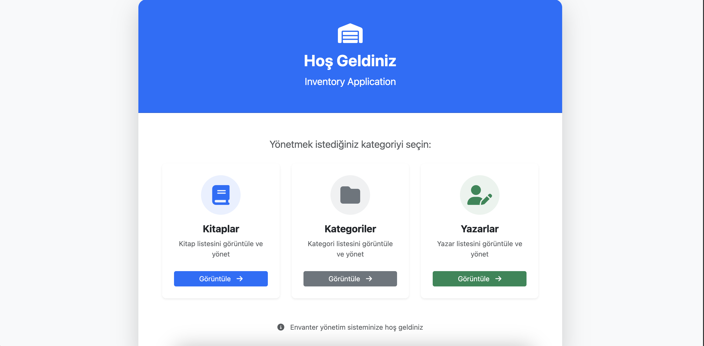
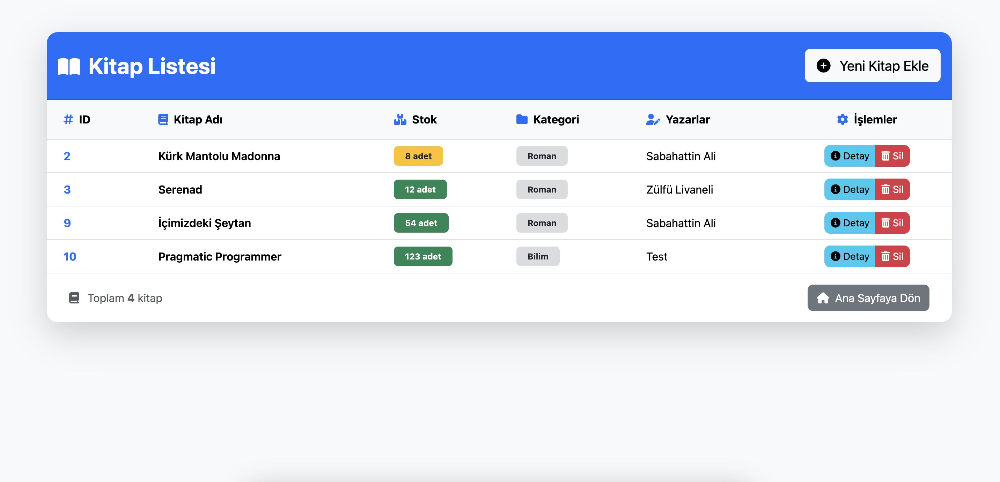
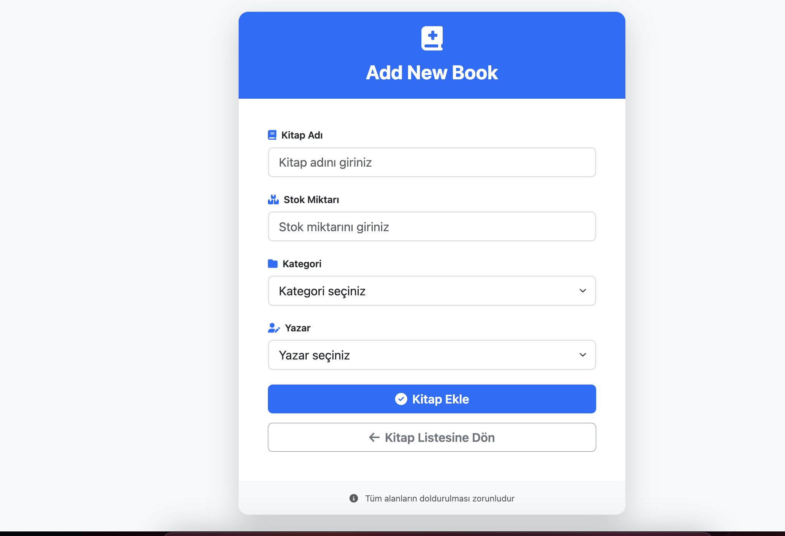
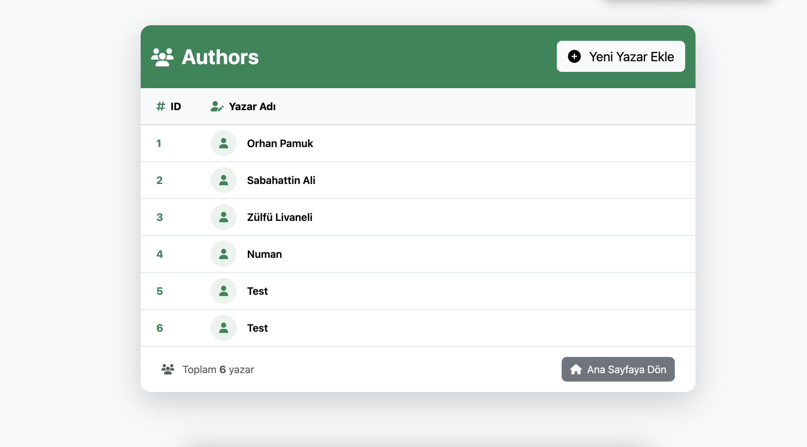
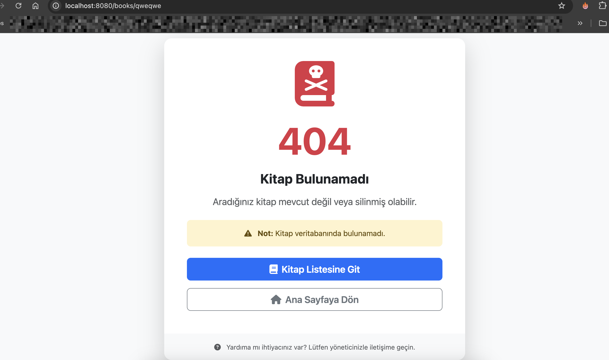

# 📚 Inventory Management System

Modern ve kullanıcı dostu bir kitap envanter yönetim sistemi. Node.js, Express ve PostgreSQL ile geliştirilmiştir.



## 🚀 Özellikler

- ✨ **Modern UI/UX**: Bootstrap 5 ile responsive ve kullanıcı dostu arayüz
- 📖 **Kitap Yönetimi**: Kitap ekleme, listeleme, detay görüntüleme ve silme
- 📁 **Kategori Yönetimi**: Kategorileri organize etme ve yönetme
- ✍️ **Yazar Yönetimi**: Yazar bilgilerini ekleme ve listeleme
- 🔒 **Güvenli Silme**: İlişkili kayıtlar varsa silme işlemini engelleme
- 📊 **Stok Takibi**: Dinamik stok seviyesi göstergeleri
- 🎨 **Renk Kodlu Tasarım**: Her modül için farklı renk teması



## 🛠️ Teknolojiler

### Backend
- **Node.js**: JavaScript runtime
- **Express.js**: Web framework
- **PostgreSQL**: İlişkisel veritabanı
- **EJS**: Template engine

### Frontend
- **Bootstrap 5**: CSS framework
- **Font Awesome**: İkon kütüphanesi
- **Responsive Design**: Mobil uyumlu tasarım


## 📋 Gereksinimler

- Node.js (v14 veya üzeri)
- PostgreSQL (v12 veya üzeri)
- npm veya yarn

## 📁 Proje Yapısı

```
inventory-management/
├── db/
│   ├── pool.js           # Veritabanı bağlantı havuzu
│   └── queries.js        # Veritabanı sorguları
├── controllers/
│   ├── books/
│   ├── categories/
│   └── authors/
├── routes/
│   ├── books/
│   ├── categories/
│   └── authors/         # Uygulama rotaları
├── views/
│   ├── index.ejs         # Ana sayfa
│   ├── books.ejs         # Kitap listesi
│   ├── bookDetail.ejs    # Kitap detay
│   ├── categories.ejs    # Kategori listesi
│   ├── authors.ejs       # Yazar listesi
│   ├── newBook.ejs       # Yeni kitap formu
│   ├── newCategory.ejs   # Yeni kategori formu
│   ├── newAuthor.ejs     # Yeni yazar formu
│   └── 404.ejs           # Hata sayfası
├── app.js                # Ana uygulama dosyası
├── package.json
└── README.md
```



## 🎨 Renk Teması

## 🔐 Güvenlik Özellikleri

- **İlişkisel Bütünlük**: Kategoriye veya yazara bağlı kitap varsa silme engellenir
- **Form Validasyonu**: Tüm formlarda zorunlu alan kontrolü
- **Hata Yönetimi**: Kullanıcı dostu hata mesajları
- **SQL Injection Koruması**: Parametreli sorgular kullanımı

![Yazar Listesi]

## 📊 Stok Göstergeleri

Stok miktarına göre otomatik renk kodlaması:

- 🟢 **Yeşil**: 10+ adet (Yüksek stok)
- 🟡 **Sarı**: 5-10 adet (Orta stok)
- 🔴 **Kırmızı**: 0-5 adet (Düşük stok)

## 👤 Geliştirici

**Your Name**

- GitHub: [@mnumanmercan](https://github.com/mnumanmercan)
- LinkedIn: [mnmercan](https://www.linkedin.com/in/mnmercan/)

## 🙏 Teşekkürler

- [Bootstrap](https://getbootstrap.com/) - UI framework
- [Font Awesome](https://fontawesome.com/) - İkonlar
- [PostgreSQL](https://www.postgresql.org/) - Veritabanı
- [Express.js](https://expressjs.com/) - Web framework

---

⭐ Bu projeyi beğendiyseniz yıldız vermeyi unutmayın!

