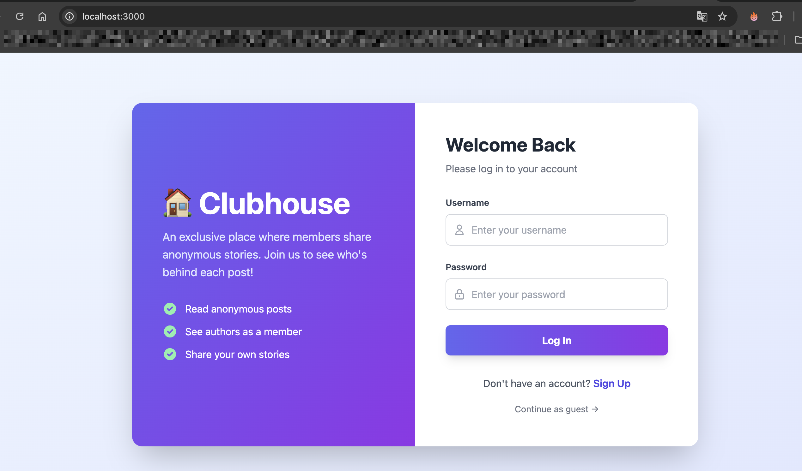
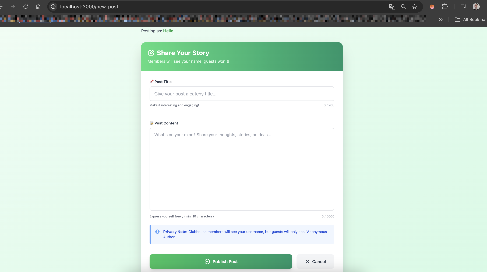
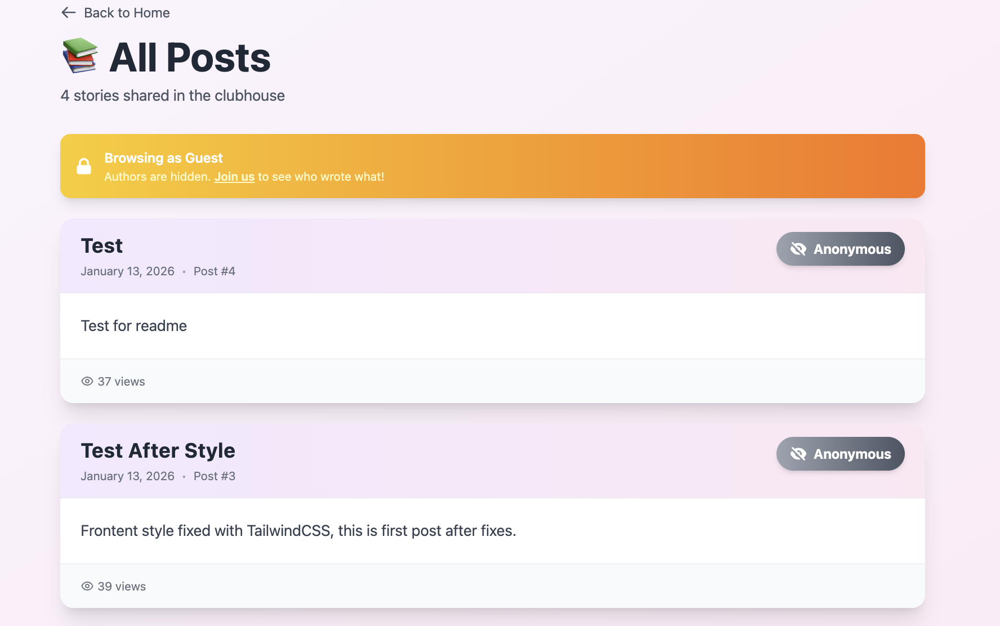
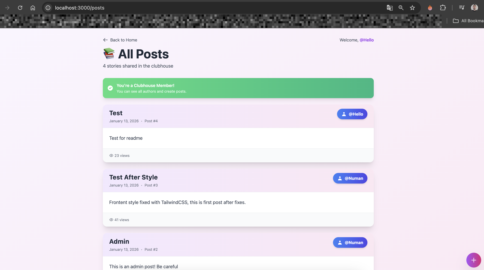
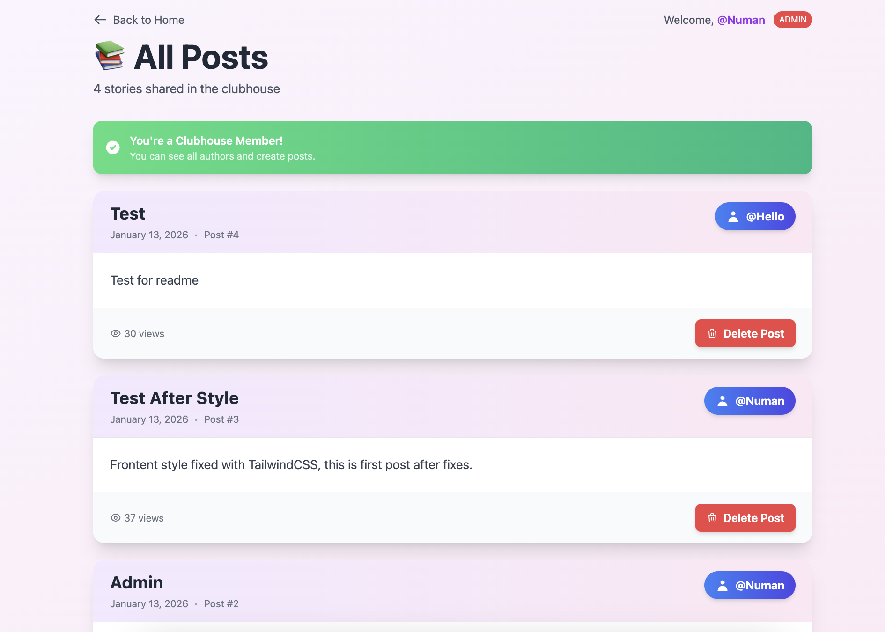

# 🏠 Clubhouse - Anonymous Storytelling Platform

Clubhouse is a web application where members share stories anonymously. Guests can read posts but can't see authors, while members see everyone's real names.

---

## 🛠️ Tech Stack

- **Backend:** Node.js, Express.js, PostgreSQL
- **Authentication:** Passport.js (Local Strategy)
- **Frontend:** EJS, Tailwind CSS
- **Security:** bcrypt password hashing

---

## ✨ Core Features

- **Guests:** Read posts with anonymous authors
- **Members:** See real authors, create posts
- **Admins:** Manage users and delete posts

---

## 📄 Pages

### 🏠 Homepage / Login
The main entry point where users can log in or sign up.

**Features:**
- Login form for existing users
- Welcome dashboard for logged-in members
- Quick access to create posts and admin panel (for admins)



---

### 📝 Sign Up
Registration page for new users to join the clubhouse.

**Features:**
- Username, email, and password fields
- Password strength indicator
- Input validation (frontend + backend)
- Benefits list for new members


---

### ✍️ Create Post
Members can write and publish new posts.

**Features:**
- Title and content form fields
- Character counter (200 for title, 5000 for content)
- Privacy notice explaining author visibility
- Only accessible to logged-in members



---

### 📚 All Posts
Browse all stories shared in the clubhouse.

**Features:**
- **For Guests:** Authors appear as "Anonymous"
- **For Members:** Real usernames are visible
- Post cards with title, content, date, and author
- **For Admins:** Delete button on each post

**Guest View:**


**Member View:**


---

### 🔧 Admin Panel
Admin-only dashboard for managing the platform.

**Features:**
- View all users and their roles
- Change user roles (Normal ↔ Admin)
- View and delete any post
- User statistics



---

```sql
-- Users table
CREATE TABLE users (
    id SERIAL PRIMARY KEY,
    username VARCHAR(50) UNIQUE NOT NULL,
    email VARCHAR(100) UNIQUE NOT NULL,
    password_hash VARCHAR(255) NOT NULL,
    role VARCHAR(20) DEFAULT 'normal' NOT NULL,
    created_at TIMESTAMP DEFAULT CURRENT_TIMESTAMP
);

-- Posts table
CREATE TABLE posts (
    id SERIAL PRIMARY KEY,
    user_id INTEGER REFERENCES users(id) ON DELETE CASCADE,
    title VARCHAR(200) NOT NULL,
    content TEXT NOT NULL,
    created_at TIMESTAMP DEFAULT CURRENT_TIMESTAMP
);
```

---

## 🔐 How Authentication Works

1. Users sign up → Password is hashed with bcrypt
2. Login → Passport.js validates credentials
3. Session created → User stays logged in
4. Protected routes → Only members/admins can access certain pages

---

## 👤 User Roles

| Role | Can Read Posts | Can See Authors | Can Create Posts | Can Delete Posts | Admin Panel |
|------|---------------|-----------------|------------------|------------------|-------------|
| Guest | ✅ | ❌ | ❌ | ❌ | ❌ |
| Normal | ✅ | ✅ | ✅ | ❌ | ❌ |
| Admin | ✅ | ✅ | ✅ | ✅ | ✅ |

---

## 📝 License

MIT License

---

Made with ❤️ for learning authentication with Passport.js